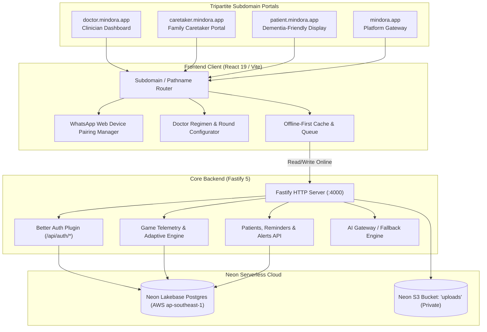
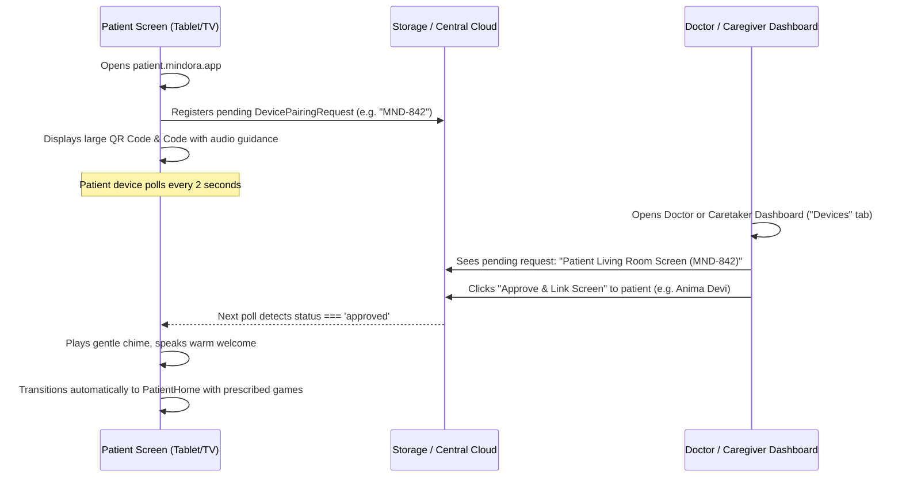

# Mindora System Architecture

This document provides a comprehensive technical overview of Mindora's architecture, engineering choices, database schemas, telemetry pipeline, multi-portal routing, clinical control engine, zero-friction authentication, and integration boundaries.

---

## 1. High-Level Architecture & Tripartite Portals

Mindora is designed around a **tripartite multi-portal architecture** where clinical oversight, daily family care, and elderly engagement operate with zero friction across dedicated subdomains:

---

## 2. Dedicated Subdomain Architecture

To ensure total cognitive clarity and avoid mode confusion, the application is segmented into isolated portals:

| Portal | Subdomain | Pathname Fallback | Role & Purpose |
|---|---|---|---|
| **Landing Gateway** | `mindora.app` | `/` or `/landing` | High-level platform introduction and direct portal entry points. |
| **Doctor Portal** | `doctor.mindora.app` | `/doctor` | Neurologist/clinician control center: multi-patient cohort management, activity prescriptions (enable/disable, sequencing, rounds), medical reminders, and clinical telemetry. |
| **Caretaker Portal** | `caretaker.mindora.app` | `/caretaker` | Family and nursing dashboard: routine reminders, WhatsApp Web device pairing authorizations, cognitive adherence tracking, and AI daily briefings. |
| **Patient Screen** | `patient.mindora.app` | `/patient` | Zero-password, distraction-free interface for elderly individuals; automatically loads doctor-prescribed activity sequence and spoken reminders. |

> [!NOTE]
> The top navigation bar intentionally contains **zero mode-switching buttons** (`overview`, `patient mode`, `caretaker`). Users interact with their dedicated portal, and patient screens remain completely unencumbered by administrative controls.

---

## 3. WhatsApp Web-Style Zero-Friction Patient Pairing

Dementia patients and elderly individuals cannot be expected to remember alphanumeric passwords, navigate multi-factor auth, or enter verification codes. Mindora resolves this through a **WhatsApp Web-style device authorization pattern**:

### 3.1 Device Revocation & Security
- Doctors and Caretakers can review all active linked screens at any time and revoke them with a single tap.
- Revocation immediately returns the patient screen to the standby pairing state.

---

## 4. Doctor Clinical Control & Activity Prescription Engine

Doctors possess clinical authority over each patient's cognitive regimen:

1. **Activity Selection**: The doctor can enable or disable any of the 4 cognitive activities based on the patient's individual clinical profile (e.g., disable Pattern Recognition if visual sequencing causes fatigue).
2. **Step Sequencing**: The doctor determines the execution order (1st Step $\to$ 2nd Step $\to$ 3rd Step $\to$ 4th Step).
3. **Round Counts**: The doctor configures the number of rounds per activity (**3, 5, or 7 rounds**).
4. **Clinical Directives**: Doctors can attach specific clinical goals and per-activity notes (e.g. *"Encourage slow visual scanning; focus on hibiscus and familiar tea cup"*).
5. **Transparency**: The Caretaker portal provides a read-only *"Doctor's Regimen"* tab ensuring the family understands the clinical rationale.

---

## 5. Multi-Patient Cohort Architecture

Both Doctor and Caregiver dashboards support managing multiple patients:

- **Patient Profiles**: Stored with individualized language preferences, cognitive baseline scores, and clinical diagnoses.
- **Active Patient Context**: Switching active patients seamlessly refreshes all telemetry charts, pending reminders, activity prescriptions, and linked devices.

---

## 6. Telemetry & Non-Diagnostic Principles

### 6.1 Accurate Statistical Measurement
All game sessions calculate genuine interaction accuracy:
$$\text{Accuracy} = \frac{\sum_{r=1}^{N} \text{Round Accuracy}_r}{N}$$
Metrics are never capped at artificial failure minimums (such as 35%). An entirely missed session produces true 0% accuracy, while flawless execution produces 100%.

### 6.2 Deterministic Adaptive Difficulty
Mindora calculates rolling performance across recent sessions:
- **Promotion Threshold**: Rolling accuracy $\ge 85\%$ triggers gentle difficulty advancement (+1 level).
- **Maintenance Range**: Rolling accuracy between $56\%$ and $84\%$ maintains stability and reassurance.
- **Relief Threshold**: Rolling accuracy $\le 55\%$ gently scales back difficulty to avert patient frustration.

---

## 7. Multilingual Localization

Mindora provides native localization across 5 Indian languages without bracketed transliterations:
- **English (`en`)**
- **Assamese (`as`)** — অসমীয়া
- **Hindi (`hi`)** — हिन्दी
- **Bengali (`bn`)** — বাংলা
- **Kannada (`kn`)** — ಕನ್ನಡ

All UI controls, game scenario prompts, objects, greetings, and reminders dynamically translate when the language toggle is switched.
