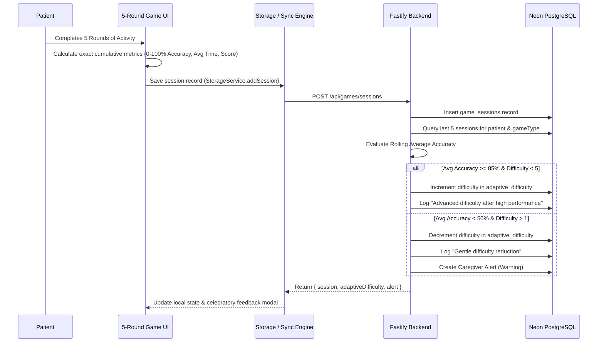

# Mindora Cognitive Games & Clinical Design Choices

This document outlines the design philosophy, cognitive targets, multilingual localization, 5-round attempt structure, and mathematically accurate telemetry behind the four core games in Mindora.

---

## 1. Design Philosophy: Calming, Dignified, Non-Diagnostic

1. **Error-Tolerant Feedback**: Traditional games penalize mistakes with harsh buzzers or flashing red screens. Mindora uses soft audio chimes, neutral retry animations, and warm affirmation.
2. **No Medical Jargon**: No scoreboards labeled "Dementia Severity" or "Cognitive Decline". Activities are framed as "Daily Brain Warmups" and "Familiar Memories".
3. **Doctor-Prescribed Rounds Per Attempt**: Rather than a single trivia question, every activity is structured as a multi-round session (**3, 5, or 7 rounds**, as prescribed by the patient's neurologist/doctor in the Doctor Portal) to gather sufficient cognitive data points, encourage steady attention, and provide unhurried engagement.
4. **Universal Familiar Objects**: Objects are clean, everyday household items, plants, and familiar tools (Tea, House, Bell Pot, Singing Bird, Spectacles, Wall Clock, Flower). Regional grounding is available naturally through language without forced prefixes (e.g. "Tea" rather than forced "Assam Tea") and without cluttered inline bracketed scripts.
5. **Full Multilingual Localization**: Clean translations are rendered dynamically when the user switches languages between **English (`en`)**, **Hindi (`hi`)**, **Assamese (`as`)**, **Bengali (`bn`)**, and **Kannada (`kn`)**.

---

## 2. Telemetry & Mathematically Accurate Stats Calculation

Across all four games, statistics are **never** hardcoded to arbitrary failure minimums (e.g., 35%). Instead, metrics are calculated purely from genuine player interactions across all prescribed $N$ rounds:

$$\text{Session Accuracy} = \frac{\sum_{r=1}^{N} \text{Round Accuracy}_r}{N}$$

$$\text{Average Response Time} = \frac{\sum_{r=1}^{N} \text{Response Time}_r}{N}$$

$$\text{Score} = \max\left(0, \min\left(100, \text{round}\left(\text{Accuracy} \times 0.8 + \text{Speed Bonus}\right)\right)\right)$$

*If a player gets 0 out of 5 rounds right, their measured accuracy is strictly 0%. If they achieve 3 out of 5, accuracy is 60%. If 5 out of 5, accuracy is 100%.*

---

## 3. Game-by-Game Breakdown (5 Rounds Per Attempt)

### 3.1 Memory Match (`MemoryMatchGame.tsx`)
- **Cognitive Target**: Visual short-term memory, associative recall, spatial orientation.
- **Object Pool**: 22+ everyday objects (Tea, House, Flower, River Fish, Drum, Bell Pot, Fruit, Lantern, Book, Bicycle, Mango, Wall Clock, Hand Fan, Spectacles, Walking Cane, Bird, Tree, Clay Pot, Chair, Sun, Leaf, Umbrella).
- **Structure (5 Rounds)**:
  - **Memorize Phase (5s)**: 4 to 5 randomly chosen objects appear with clear emojis and translated names. A gentle countdown bar tracks time, with a manual "I am ready now" skip.
  - **Recall Phase**: The player is presented with 4 choices (1 correct target item + 3 distractors freshly sampled from unused pool objects).
  - Visual round dots (`Round X of 5`) reflect immediate progress.
- **Accuracy Formula**:
  $$\text{Accuracy} = \frac{\text{Correct Rounds}}{5} \times 100\%$$

---

### 3.2 Attention Challenge (`AttentionChallenge.tsx`)
- **Cognitive Target**: Selective attention, visual discrimination, inhibition of distractors.
- **Structure (5 Rounds)**:
  - **Round 1**: Find Red Items (Fruit, Hibiscus, Scarf, Ribbon). Distractors: Leaf, Marigold, Tea Cup, Pot.
  - **Round 2**: Find Blooming Flowers (Flower, Hibiscus, Marigold, Rose). Distractors: Clock, Bicycle, Tea Cup, Book.
  - **Round 3**: Find Fresh Fruits (Mango, Fruit, Banana, Grapes). Distractors: Bell, Drum, Chair, Lantern.
  - **Round 4**: Find Household Objects (Tea Cup, Clay Pot, Hand Fan, Wall Clock). Distractors: Bird, Fish, Tree, Flower.
  - **Round 5**: Find Yellow & Golden Items (Marigold, Mango, Sun, Bell Pot). Distractors: Pot, Scarf, Leaf, Ribbon.
- **Accuracy Formula**:
  $$\text{Round Accuracy} = \max\left(0, \min\left(100, \frac{\text{Correct Clicks} - 0.4 \times \text{False Clicks}}{\text{Total Targets in Round}} \times 100\right)\right)$$

---

### 3.3 Pattern Recognition (`PatternRecognition.tsx`)
- **Cognitive Target**: Sequential memory, inductive reasoning, visual rhythm continuation.
- **Structure (5 Rounds)**:
  - **Round 1**: Alternating Circle rhythm ($A \to B \to A \to B \to [?]$)
  - **Round 2**: Flower and Leaf alternating rhythm ($A \to B \to A \to B \to [?]$)
  - **Round 3**: Double-element rhythm ($A \to A \to B \to A \to A \to [?]$)
  - **Round 4**: Star and Diamond geometric rhythm ($A \to B \to A \to B \to [?]$)
  - **Round 5**: Weather three-element cycle ($A \to B \to C \to A \to B \to [?]$)
- **Accuracy Formula**:
  $$\text{Accuracy} = \frac{\text{Correctly Solved Sequences}}{5} \times 100\%$$

---

### 3.4 Daily Routine Recall (`RoutineRecallGame.tsx`)
- **Cognitive Target**: Procedural memory, Activities of Daily Living (ADL) sequencing, chronobiological recall.
- **Structure (5 Rounds)**:
  - **Round 1**: Morning Awakening (Wake up $\to$ Drink water $\to$ Take medicine $\to$ Have breakfast)
  - **Round 2**: Preparing Tea (Boil water $\to$ Add tea leaves $\to$ Pour milk $\to$ Serve in cup)
  - **Round 3**: Courtyard Gardening (Put on slippers $\to$ Step into garden $\to$ Water plants $\to$ Relax in fresh air)
  - **Round 4**: Afternoon Rest (Warm lunch $\to$ Wash hands $\to$ Afternoon rest $\to$ Wake refreshed)
  - **Round 5**: Evening Calm (Evening tea $\to$ Chat with family $\to$ Light evening lamp $\to$ Sleep peacefully)
- **Accuracy Formula**:
  $$\text{Round Accuracy} = \frac{\text{Steps Placed in Exact Position}}{\text{Total Steps in Scenario}} \times 100\%$$

---

## 4. Dynamic Adaptation Architecture

---

## 5. Multilingual Localization Table

All UI elements, instructions, objects, and feedback support 5 languages without inline brackets:

| Language Code | Language Name | Speech Locale Code |
|---|---|---|
| `en` | English | `en-IN` |
| `hi` | हिन्दी (Hindi) | `hi-IN` |
| `as` | অসমীয়া (Assamese) | `bn-IN` (TTS fallback phonetic match) |
| `bn` | বাংলা (Bengali) | `bn-IN` |
| `kn` | ಕನ್ನಡ (Kannada) | `kn-IN` |

---

## 6. Geriatric Ergonomics Checklist

| Design Parameter | Implementation in Mindora |
|---|---|
| **Touch Target Size** | All interactive cards and buttons are at least $64 \times 64\text{px}$ with $12\text{px}$ padding. |
| **Color Contrast** | Minimum 4.5:1 text-to-background ratio; optional high-contrast mode with yellow/black scheme. |
| **Font Family & Sizing** | Clear sans-serif typeface, base font size $18\text{px}$ scalable to $24\text{px}$ via Large Font Mode. |
| **Animation Durations** | Transitions are kept gentle ($400\text{ms}$ ease-out); "Reduce Motion" setting disables all parallax. |
| **Sound Design** | Soft frequency acoustic feedback (soft bells, gentle chimes); no startling sounds or shrill alarms. |
